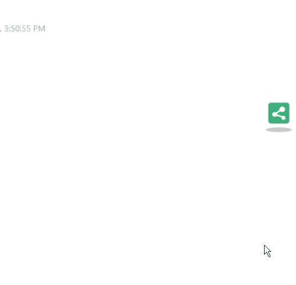

## 分享插件

此插件为Vuepress插件，为了更快捷的搭建一个博客进行演示，此处推荐使用主题[vuepress-theme-reco](https://github.com/vuepress-reco/vuepress-theme-reco)

以下是对该主题的介绍（摘抄自官网）

### Introduce

1. 这是一个vuepress主题，旨在添加博客所需的分类、TAB墙、分页、评论等功能；
2. 主题追求极简，根据 vuepress 的默认主题修改而成，官方的主题配置仍然适用；
3. 效果：[午后南杂](https://www.recoluan.com) 
4. 文档：[vuepress-theme-reco-doc](https://vuepress-theme-reco.recoluan.com)

主题效果演示


以下是次插件的效果演示



## 插件调用方式

暂时只支持本地调用  
将此插件下载到本地  
使用npm link进行项目关联

然后再`vuepress-theme-reco`主题的`index.js`中进行如下配置即可使用

```js
[require('@vuepress-ikangxu/vuepress-plugin-share'), {
  supports: ['qq-qzone', 'renren', 'douban', 'sina-weibo', 'wechat', 'tieba-baidu']
}]
```

该插件是全局的，无需新增多余代码